<!-- ══════════════════════════════════════════════════════════════════════════════
     ~/.francisrc — GitHub Profile README
     Theme: Pegasuz Panel × Neon Fire
     Palette: ff5f00 · ff8700 · ffaf00 · ffd700 · 5fffff · 87ff00 · ff0000
     ══════════════════════════════════════════════════════════════════════════════ -->

<!-- ── HEADER: custom animated SVG banner ─────────────────────────────────── -->

<a href="https://github.com/FrancisElegante">
  
</a>

<!-- ── STATUS BAR (systemctl-style) ───────────────────────────────────────── -->

<div align="center">


<br/>


</div>

<br/>


<!-- ── WHOAMI ─────────────────────────────────────────────────────────────── -->

## 🔥 `whoami`

```ini
# /etc/francisrc.conf
user            = franciselegante
uid             = 1000
role            = "Backend Engineer & Systems Architect"
domain          = "multi-tenant SaaS · AI autonomy · security labs"
location        = Remote
timezone        = America/Argentina/Buenos_Aires
shell           = /bin/zsh
editor          = nvim
kernel          = Linux
coffee          = "black, no sugar"

[runtime]
node_version    = 20.x
python_version  = 3.12
mysql_version   = 8.0
pm2_apps        = pegasuz-api, pegasuz-staging

[motto]
manifesto       = "Build systems that outlast the teams that create them."
anti_motto      = "It works on my machine is not a deployment strategy."
```

<br/>


<!-- ── DEPLOYMENTS: systemctl list-units ──────────────────────────────────── -->

## ⚡ `systemctl list-units --type=project`

```
  UNIT                    LOAD      ACTIVE    SUB        DESCRIPTION
─ ──────────────────────  ────────  ────────  ─────────  ─────────────────────────────────────────
● pegasuz.service         loaded    active    running    Multi-tenant SaaS Core (11 tenants)
● pegasuz-brain.service   loaded    active    running    Autonomous AI orchestration (private)
● wifilab.service         loaded    active    running    WiFi audit lab · pentesting commander
● cansat-messi.service    loaded    active    deployed   Satellite prototype (team MESSI)
● lampone.service         loaded    active    deployed   Terminal-noir personal portfolio
```

<br/>

<table>
<tr>
<td width="50%" valign="top">

### 🔴 `pegasuz.service`

 

**Multi-tenant SaaS platform** · Production core serving real businesses. Database-per-tenant isolation, JWT cross-validation, feature flags per client, 18 Prisma migrations, zero cross-tenant leaks.

```
Stack:    Node.js · Express · Prisma · MySQL · Vue 3
Scale:    11 tenants · 24+ entities · 34 routes · 42 services
Runtime:  PM2 · Nginx · Ubuntu VPS
```


</td>
<td width="50%" valign="top">

### 🟠 `pegasuz-brain.service`

 

**Autonomous AI orchestrator** · Parallel research project. Delegates, validates and learns across coding cycles. Memory tiers (state/knowledge/experience), dual-model pipeline, violation scoring, cycle reflection.

```
Layers:   T1 state · T2 knowledge · T3 experience · T4 intuition
Cycle:    remember → generate → validate → apply → learn → reflect
Runtime:  tmux · bash · python · LLM proxies
```


</td>
</tr>
<tr>
<td width="50%" valign="top">

### 🟡 [`wifilab.service`](https://github.com/FrancisElegante/WIFI-lab)

 

**WiFi audit commander** · Web panel orchestrating pentesting lab: adapter management, real-time scanning, deauth/handshake/PMKID attacks, GPU hashcat cracking, post-exploitation, threat intelligence with CVE/OUI/WiGLE analysis.

```
Backend:  Python 3.12 · Flask 3.0 · Flask-SocketIO · SQLite WAL
Frontend: Vue 3.5 · Vite · Pinia · TypeScript · Tailwind 4
Hardware: Archer T4U v3 · TL-WN722N v2 · 2x RTX 3090
Arsenal:  aircrack-ng · hashcat · bettercap · hydra · nmap
```


</td>
<td width="50%" valign="top">

### 🛰️ [`cansat-messi.service`](https://cansatmessi.pegasuz.com.ar/)

 

**Scale satellite prototype** · National CanSat project, team MESSI from Cipolletti, Río Negro. Prototype satellite at can-scale with onboard telemetry, payload systems, and mission monitoring. Public site hosted on Pegasuz tenant.

```
Mission:  Atmospheric telemetry · payload deployment · descent control
Tenant:   cansatmessi.pegasuz.com.ar (served by pegasuz.service)
Team:     MESSI · Cipolletti · Río Negro · Argentina
Scale:    Can-sized · real-flight prototype
```


</td>
</tr>
<tr>
<td colspan="2" valign="top">

### 🟢 `lampone.service`

 

**Terminal-noir personal portfolio** · Built as a system booting up, not a webpage loading. Visible code culture at readable opacity, architectural typography (Bebas Neue at screen-filling scale), signal green dominance, scanlines, magnetic cursor, char-by-char reveals via GSAP SplitText. Zero generic startup language.

```
Aesthetic:  late-night SSH session · glowing CRT · mechanical keyboards
Motion:     scanlines · char-reveal · magnetic cursor · atmospheric gradients
Stack:      Vue 3 · Vite · GSAP · Lenis · SplitText · JetBrains Mono + Bebas Neue
```


</td>
</tr>
</table>

<br/>


<!-- ── STACK ──────────────────────────────────────────────────────────────── -->

## 🧰 `dpkg -l | grep stack`

<div align="center">

### Backend · Runtime


### Databases


### Frontend


### Ops · Infrastructure · Security


### Tools · Arsenal


</div>

<br/>


<!-- ── STATS ──────────────────────────────────────────────────────────────── -->

## 📊 `htop --user=francis`

<div align="center">


<br/>


<br/><br/>


</div>

<br/>


<!-- ── PRINCIPLES: tail -f ────────────────────────────────────────────────── -->

## 📜 `tail -f /var/log/principles.log`

```diff
[2026-04-16 16:42:01] INFO  src/core/engineering.ts
+ Database-per-tenant isolation over shared schema shortcuts
+ Explicit contracts over implicit magic
+ Read-only diagnostics before write operations
+ Invariants as code, not as folklore
+ Boring tech that ships over novel tech that promises
+ Tests that prove isolation, not tests that prove coverage
+ Fail in voice, not in silence

[2026-04-16 16:42:01] WARN  src/core/anti-patterns.ts
- Generic startup language ("elevate", "revolutionize", "empower")
- AI autonomy without supervision checkpoints
- Migrations without parity verification across tenants
- Monoliths masquerading as microservices
- Features without feature flags
- "It works on my machine" as deployment strategy
! God-objects over 1500 lines in single files
```

<br/>


<!-- ── PS AUX ─────────────────────────────────────────────────────────────── -->

## 🔧 `ps aux | grep francis | head -5`

```
USER      PID    %CPU   %MEM   STATE     TIME      COMMAND
francis   1001   94.3%  42.1%  RUNNING   1847h     schema-parity automation for pegasuz
francis   1002   88.7%  38.5%  RUNNING   1203h     autonomous orchestration cycles · brain
francis   1003   76.2%  31.8%  RUNNING   892h      motion layer refactor · lampone-v2
francis   1004   81.5%  44.2%  RUNNING   1521h     wifilab intelligence scoring engine
francis   1005   12.0%  04.0%  IDLE      ---       writing more at the shell prompt
```

<br/>

<!-- ── FOOTER ─────────────────────────────────────────────────────────────── -->


<div align="center">


<br/><br/>

<sub>`[EOF]` · `connection closed by remote host` · `exit 0`</sub>

</div>

<!-- ══════════════════════════════════════════════════════════════════════════════
     END ~/.francisrc
     ══════════════════════════════════════════════════════════════════════════════ -->
